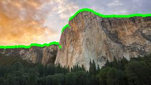
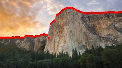
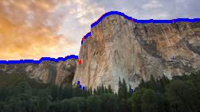

# Part 1: IJK

IJK is a sliding tile game played on a 4x4 board by two players, lowercase (also known as -) and uppercase
(+). The players take turns, starting with uppercase. At the start of each turn, a tile labeled a is added
randomly somewhere on the board if it is lowercase’s turn, and an A is added if it is uppercase’s turn. A
player’s turn consists of making one of five possible moves: Up, Down, Left, Right, or Skip. Skip means
nothing further happens and the player forfeits their turn. Otherwise, all tiles are slid in the direction that
the player selected until there are no empty spaces left in that direction. Then, pairs of letters that are the
same, of the same case, and adjacent to each other in the direction of the movement are combined together
to create a single tile of the subsequent letter and the same case. For example, if an A slides down and hits
another A, the two merge and become a single B. Similarly, pairs of B’s merge to become a single C, and so
on. For pairs of letters that are the same but with opposite case, e.g. A and a, the tiles merge to become
the letter B if it is uppercase’s turn, or b if it is lowercase’s turn. The game ends when a K or k appears on the board, and the player of that case wins the game.

The game has two specific variants. In Deterministic IJK, the new a or A at the beginning of each turn
is added to a predictable empty position on the board (which is a function of the current board state). In
Non-deterministic IJK , the new a or A is added to a random position on the board. The rest of the rules
are the same for the two variants.

Your goal is to write AI clode that plays these two variants of IJK well.

```
./ijk.py [uppercase-player] [lowercase-player] [mode]
 where uppercase and lowercase player could be AI or Human or same, and mode is "det" for Deterministic approach and "nondet" for Non-deterministic approach.
 ```
 
 ## Solution
 
 ### Deterministic approach : 
 
 Min Max algorithm with Alpha, Beta Pruning and depth cutoff
 
 Citation : https://www.geeksforgeeks.org/minimax-algorithm-in-game-theory-set-4-alpha-beta-pruning/
 
 Algorithm
 
 ```
-> Alpha-Beta-Decision(S)
    Return action leading to state S’SUCC(S) that maximizes MIN-Value(S’,-inf,+inf)
-> MAX-Value(S,alpha,beta)
    If Terminal?(S) return Result(S)
    For all S’ <- SUCC(S)
         alpha <- max(alpha,MIN-Value(S’,alpha,beta))
         If alpha >= beta, then return alpha
    Return alpha
-> MIN-Value(S,alpha,beta)
    If Terminal?(S) return Result(S)
    For all S’in SUCC(S)
         beta <- min(beta,MAX-Value(S’,alpha,beta))
         If alpha >= beta, then return beta
    Return beta
```

The code has a dynamic behavior based on the depth, we can change the depth with requirement. For the current algorithm we have used depth as 5 which will look ahead of next 4 moves with Min and Max moves for all the 4 possibilities of 'L', 'R', 'U', and 'D'

Formal abstraction

```
States: Any arrangement of alphabets from a - k and A - K

Initial state S0: Given input

Successor function: Given by available actions L, R, U, D to move closer to the goal state

Goal state: whichever player reaches letter K/k first. If both the players does not reach then the player with highest letter wins, else its a tie if both the players have same letter

Evaluation function: In this we have used number of empty tiles and weighted difference in the alphabets of capital and small letters
```

Evaluation function example :


```
weights = {'a' : 1, 'b' : 2, 'c' : 3, 'd' : 4, 'e' : 5, 'f': 6, 'g':7, 'h':8, 'i':9, 'j':10, 'k':11,
            'A' : 1, 'B' : 2, 'C' : 3, 'D' : 4, 'E' : 5, 'F': 6, 'G':7, 'H':8, 'I':9, 'J':10, 'K':11, 
            ' ':0}
Board :
           _ _|_ _|_ _|_ _|_ _|_ _
           _ _|_ _|_ _|_ _|_ _|_ _
           _ _|_ _|_ _|_ _|_f_|_A_
           _ _|_ _|_ _|_ _|_ _|_ _
           _ _|_ _|_ _|_ _|_ _|_ _
           _ _|_ _|_ _|_ _|_ _|_ _
           
Weighted difference in alphabets :

For a Max player = ord(A)*weight['A'] - ord(f)*weight['f']
For a Min player = ord(f)*weight['f'] - ord(A)*weight['A']

Number of empty tiles = 34

Evaluation function = weighted difference in alphabets + Number of empty tiles
```

Sample Output

```
- played: R
_C_|_b_|_d_|_b_|_D_|_h_
_B_|_f_|_g_|_d_|_e_|_J_
_c_|_d_|_f_|_g_|_h_|_i_
_b_|_C_|_e_|_F_|_e_|_h_
_A_|_b_|_d_|_e_|_G_|_c_
_A_|_b_|_B_|_d_|_f_|_a_


Winner was:  J
```

### Non Deterministic Approach

Expecti Minimax Algorithm with depth cut off

Algorithm

```
At Chance nodes : ExpectedValue(s) = sum of s’ in SUCC(s) ExpectedValue(s’)*P(s’)
At Max Nodes    : MinimaxValue(s) = max s’in SUCC(s) MinimaxValue(s’)
At Min Nodes    : MinimaxValue(s) = min s’ in SUCC(s) MinimaxValue(s’)

```

The code has a dynamic behavior based on the depth, we can change the depth with requirement. For the current algorithm we have used depth as 3 which will look ahead next 2 moves by considering chance nodes

The probability of chance nodes is calculated based on the number of empty tiles of the current board

Formal abstraction

```
States: Any arrangement of alphabets from a - k and A - K

Initial state S0: Given input

Successor function: Given by available actions L, R, U, D to move closer to the goal state

Goal state: whichever player reaches letter K/k first. If both the players does not reach then the player with highest letter wins, else its a tie if both the players have same letter

Evaluation function: In this we have used number of empty tiles and weighted difference in the alphabets of capital and small letters
```

Sample Output

```
- played: R
_C_|_b_|_d_|_b_|_D_|_h_
_B_|_f_|_g_|_d_|_e_|_J_
_c_|_d_|_f_|_g_|_h_|_i_
_b_|_C_|_e_|_F_|_e_|_h_
_A_|_b_|_d_|_e_|_G_|_c_
_A_|_b_|_B_|_d_|_f_|_a_


Winner was:  J
```

### Heuristic functions tried

1) Number of empty tiles
2) Weighted difference in the alphabets of capital and small letters
3) Difference between highest letter of player 1 and player 2
4) ASCII value of highest letter for the given player
5) Linear combination of above heuristics by assigning weights to each of them and running the code among themselves (AI vs AI)

Finally sum of 1) and 2) proved out to be the best combination of heuristics 

# Part 2: Horizon finding

A classic problem in computer vision is to identify where on Earth a photo was taken using visual features
alone (e.g., not using GPS). For some images, this is relatively easy — a photo with the Eiffel tower in it
was probably taken in Paris (or Las Vegas, or Disneyworld, or ...). But what about photos like Fig 2a? One
way of trying to geolocate such photos is by extracting the horizon (the boundary between the sky and the
mountains) and using this as a “fingerprint” that can be matched with a digital elevation map to identify
where the photo was taken.

Let’s consider the problem of identifying horizons in images. We’ll assume relatively clean images like that of
Figure 2a, where the mountain is plainly visible, there are no other objects obstructing the mountain’s ridgeline, the mountain takes up the full horizontal dimension of the image, and the sky is relatively clear. Under
these assumptions, for each column of the image we need to estimate the row of the image corresponding to
the boundary position. Plotting this estimated row for each column will give a horizon estimate.
We’ve given you some code that reads in an image file and produces an “edge strength map” that measures
how strong the image gradient (local constrast) is at each point. We could assume that the stronger the
image gradient, the higher the chance that the pixel lies along the ridgeline. So for an m × n image, this is a
2-d function that we’ll call I(x, y), measuring the strength at each pixel (x, y) ∈ [1, m] × [1, n] in the original
image. Your goal is to estimate, for each column x ∈ [1, m], the row sx corresponding to the ridgeline. We
can solve this problem using a Bayes net, where s1, s2, ...sm correspond to the hidden variables, and the
gradient data are the observed variables (specifically w1, w2, ...wm, where w1 is a vector corresponding to
column 1 of the gradient image).

1. Perhaps the simplest approach would be to use the Bayes Net in Figure 2b. You’ll want to estimate
the most-probable row sx* for each column x ∈ [1, m], si* = arg max P(Si = si |w1, ..., wm)

2. A better approach would use the Bayes Net in Figure 1a. Use the Viterbi algorithm to solve for the
maximum a posterior estimate,
arg max P(S1 = s1, ..., Sm = sm|w1, ..., wm),


3. A simple way of improving the results further would be to incorporate some human feedback in the
process. Assume that a human gives you a single (x, y) point that is known to lie on the ridgeline.
Modify your answer to step 2 to incorporate this additional information. Show the detected boundary
in green superimposed on the input image in an output file called output human.jpg

```
Your program should be run like this:
./horizon.py input_file.jpg row_coord col_coord

where row coord and col coord are the image row and column coordinates of the human-labeled pixel.
```
Hints. What should the emission and transition probabilities be? There’s no right answer here, but intuitively
you’ll want the emission probabilities P(wi|Si = si) to be chosen such that they are high when si is near a strong edge according to the gradient image, and low otherwise. The idea behind the transition probabilities is to encourage “smoothness” from column to column, so that the horizon line doesn’t randomly jump around. In other words, you’ll want to define P(Si+1 = si+1|Si = si) so that it’s high if si+1 ≈ si and is low if not.

## Solution

### Method 1

```
si* = arg max P(Si = si |w1, ..., wm)
```

Emission probability : In this case, the emission probability is the edge_strength of the point divided by the sum of the edge_strength of the rows of the column the point lies in. the emission probabilities are considered in a way higher the gradient, higher the emission probability, In our approach, we have considered the emission probability to be edge_strength of the point divided by the sum of the edge_strength of all the points in that column. 

Transition probability does not matter as each pixel will have same probability in this method.

Therefore, the above results in finding the maximum edge_strength in a particular column.

Sample Output



### Method 2

```
Viterbi Algorithm

Let vi(t) be the probability of the most probable path ending at state i at time t,

vi(t) = max P(Q0 = q0,..........Qt-1 = qt-1, Qt = i | O0, O1........ Ot)

Then we can recursively find the probability of the most probable path ending at state j at time t+1

vj(t+1) = ej(Ot + 1) max [vi(t) * pij]
```

Emission probability :The emission probabilities P(wi|Si = si) should be chosen in such a way that they are high when si is near a strong edge according to the gradient image, and low otherwise. Therefore, the emission probabilities are considered in a way higher the gradient, higher the emission probability, In our approach, we have considered the emission probability to be edge_strength of the point divided by the sum of the edge_strength of all the points in that column. 

Transition probability :Since the transition probabilities are to be  selected in such a way so as to encourage “smoothness” from column to column, so that the horizon line doesn’t randomly jump around. In other words, we have defined P(Si+1 = si+1|Si = si) so that it’s high if si+1 ≈ si and is low if not. Based on our approach, we have assumed the transition probability to be equal to 0.1 if difference between the column j (j being the next column) and column i (i being the previous column) is less than  or equal to 4. The remaining 0.1 probability will be distributed equally to the remainder of the points in that column.

Sample Output



### Method 3

Emission probability :In this approach, emission probability has been considered highfor the given point and lower for the rest of the points in the points in the column the given point lies in. We have considered an emission probability of 0.999 for the given coordinate and 0.001 has been distributed equally among the points in that column.

Transition probability : The approach for transition probability is same as explained in method 2.

Sample Output 



